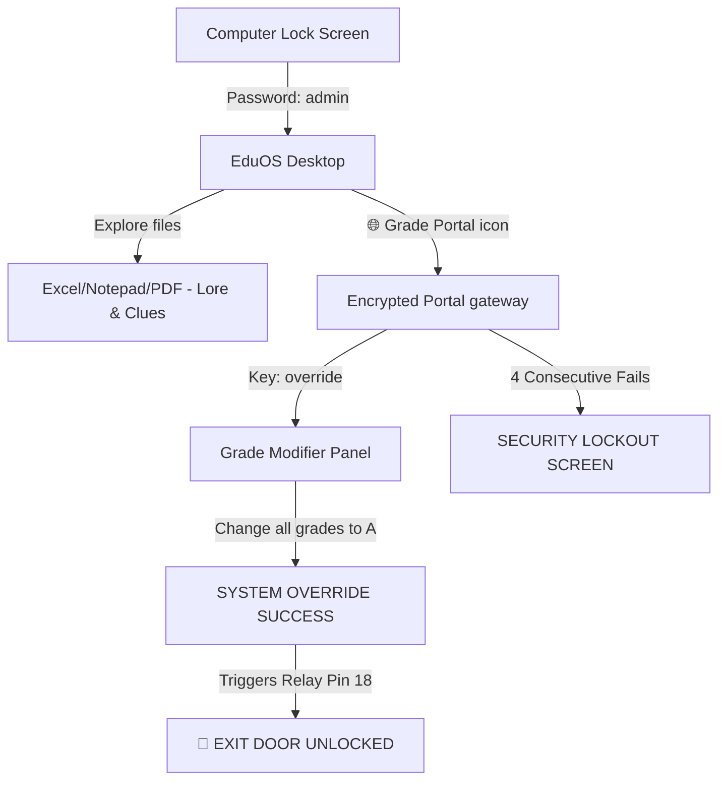

# EduOS Professional — Principal's Workstation

> [!IMPORTANT]
> **OPERATIONAL SUMMARY (READ FIRST)**
> * **Display Mode:** This application runs in **Immersive Fullscreen Mode** by default on all platforms. Keyboard focus is held so players cannot escape or access the underlying operating system.
> * **Game Master Escape Backdoor:** To exit the application at any time, hold **`Control + Option`** (or **`Control + Alt`**) and tap the **`Escape`** key **3 times quickly (in under 1.5 seconds)**. Active at all times, including on win/lose screens.
> * **Game Master Reset Backdoor:** To restart/reset the game at any time for another play, hold **`Control + Option`** (or **`Control + Alt`**) and tap the **`R`** key **3 times quickly (in under 1.5 seconds)**. This relocks the physical maglock, clears any lockout counters, and restarts the game cleanly.
> * **System Passwords:**
>   * **Computer Lock Screen Login:** `admin`
>   * **District Grades Portal gateway Key:** `override`

---

## 🚀 Running the Application

### 🍎 For macOS (Beginner-Friendly)

If you are new to using the command line, follow these step-by-step instructions to get the game running on your Mac:

1. **Open the Terminal App:**
   * Press **`Command (⌘) + Spacebar`** on your keyboard to open Spotlight Search.
   * Type **`Terminal`** and press **`Return`**. This opens a text-based terminal window.

2. **Navigate to the Game Folder:**
   * In the Terminal window, type **`cd `** (make sure to include the space after `cd`, but **do not** press Return yet).
   * Open **Finder** and locate your project folder. Drag and drop the folder directly into the Terminal window. The Terminal will automatically fill in the folder's path.
   * Press **`Return`** on your keyboard to navigate into the folder.

3. **Install Dependencies:**
   * Copy and paste the following command into your Terminal and press **`Return`**:
     ```bash
     pip3 install -r requirements.txt
     ```
   * *Note:* If you receive a `pip3: command not found` error, you may need to install Python first. You can download it from the official [Python website](https://www.python.org/downloads/mac-osx/).

4. **Launch the Game:**
   * Start the workstation simulation by running:
     ```bash
     python3 main.py
     ```
   * > [!IMPORTANT]
     > The application will run in **Immersive Fullscreen Mode** and capture keyboard focus. 
     > To exit the game at any time, hold **`Control`** and **`Option (⌥)`** and tap the **`Escape`** key **3 times quickly**.

---

### 🍓 For Raspberry Pi (Hardware Deployment)

To deploy the game in a physical escape room setup on a Raspberry Pi:

1. **Install System-Level Libraries:**
   Tkinter and GPIO backends must interface with the Raspberry Pi OS kernel. Install the required system packages first:
   ```bash
   sudo apt update
   sudo apt install -y python3-tk python3-gpiozero python3-lgpio python3-pil python3-pil.imagetk
   ```

2. **Navigate to the Folder:**
   Change directory to the project location:
   ```bash
   cd /path/to/principal
   ```

3. **Install Python Packages:**
   On recent Raspberry Pi OS editions (Bookworm and newer), external pip installations are managed. You can safely install the packages system-wide:
   ```bash
   pip3 install -r requirements.txt --break-system-packages
   ```
   Or set up a virtual environment utilizing your system-installed packages:
   ```bash
   python3 -m venv --system-site-packages venv
   source venv/bin/activate
   pip3 install -r requirements.txt
   ```

4. **Run the Game:**
   Execute the application. The system will automatically detect the Pi environment and activate BCM GPIO Pin 18 to control your physical maglock relay:
   ```bash
   python3 main.py
   ```

---

## 🎮 Game Flow Overview

The game simulates the "EduOS Professional" desktop on a high school principal's workstation. Players must navigate the desktop to hack into the District Grade Database and override a student's grades to trigger the physical door release.



### 🖥️ Start Menu Dialog
* **Trigger:** Click the green **"Start"** button on the bottom left taskbar.
* **Aesthetic:** Designed to mimic a classic **Windows XP-style dialog** box with a beige background (`#ece9d8`), a royal blue border, a blue gradient title bar, and a red Close button, but with *no icons*.
* **Menu Options:** Pops open a text-only menu containing shortcuts for:
  * **School Budget**
  * **Suspension List**
  * **Detention Logs**
  * **Grade Portal**
* **Dynamic Hover Effect:** Hovering over menu items highlights them in a solid blue background (`#316ac5`) with white text.
* **Auto-Dismiss:** To ensure a clean and fluid experience, the Start Menu automatically closes when the player clicks *anywhere* else on the screen (such as the desktop wallpaper or taskbar) or activates a shortcut.
* **Footer Actions:** Includes clean text buttons for **Log Off** and **Shut Down** at the bottom.

---

## 🔒 Escape & Lockout Mechanics

### 1. Win Condition (System Override)
* **Objective:** Open the **Grade Portal**, authenticate, and change all subjects for student *Alex Mercer* (Math, History, Chemistry) to **"A"**.
* **Commit Changes:** Click "Commit Changes to Server". 
* **The Victory Sequence:**
  1. Shows a simulated green database sync progress bar in real-time.
  2. Synthesizes and plays a custom retro 8-bit winning arpeggio sound chime asynchronously.
  3. Releases the **physical door maglock** by activating **BCM GPIO Pin 18** (sending a High 3.3V signal to your relay).
  4. Runs a beautiful, animated **Green Matrix digital rain screensaver** on the fullscreen display.

### 2. Lockout Penalty (Lose Screen)
* **Trigger:** Players are allowed **3 incorrect login attempts** on the Grades Portal. 
* **The Lockout Sequence:** On the **4th consecutive failure**, the system permanently locks out:
  1. Closes the gateway, turns the screen a deep dark red, and runs an animated **Red Matrix digital rain screensaver**.
  2. Displays bold HUD warnings: `SECURITY BREACH DETECTED - SYSTEM PERMANENTLY LOCKED`.
  3. Synthesizes and plays a retro 8-bit dual-tone hazard alarm klaxon siren asynchronously.
  4. The only way to exit the lockout screen is using the **Game Master Backdoor** shortcut.

---

## 🛠️ Installation & Hardware Setup

### 1. System Packages (Linux/Raspberry Pi)
Run the following commands in the terminal to set up the system-level Python libraries (Tkinter GUI, GPIO Zero, Pillow images, and the Pi 5 GPIO backend):

```bash
sudo apt update
sudo apt install -y python3-tk python3-gpiozero python3-lgpio python3-pil python3-pil.imagetk
```

### 2. Python Dependencies (Pip)
Navigate to the directory and install requirements:
```bash
pip install -r requirements.txt
```

### 3. Hardware Wiring (Maglock Relay)
Connect your physical relay board to the Raspberry Pi:
* **Relay Signal (IN):** **GPIO 18** (BCM Pin 12 on standard Pi header).
* **VCC:** 3.3V or 5V (as required by your relay board).
* **GND:** Ground.
* **Relay Output (COM/NO):** Wired to break or complete the circuit powering your 12V/24V magnetic lock.

---

## 🛠️ Diagnostics & Files

* **`main.py`:** Main application source code.
* **`requirements.txt`:** Package dependencies.
* **`win.wav` / `lose.wav`:** Dynamically synthesized audio files (generated on runtime and automatically excluded from Git tracking).
